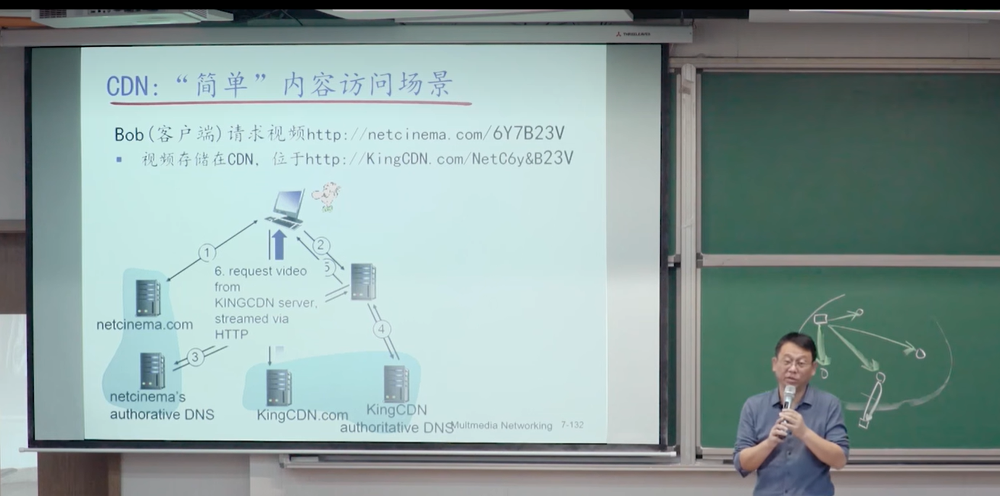
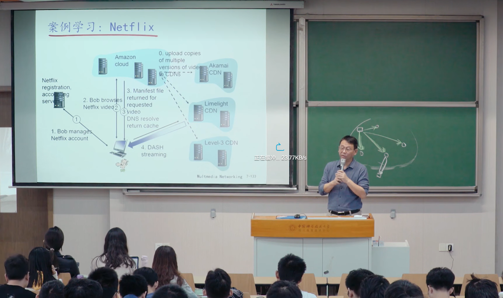

# 多媒体服务流化与CDN

## 视频服务的特性

### 视频文件简介

视频流化服务和CDN（Content Distribution Network）

视频：按照一定速率显示的连续图片

视频基于两个冗余性可以压缩：

- 空间冗余性：连续空间颜色相似
- 时间冗余性：

### 多媒体流化服务：DASH协议

**DASH**: Dynamic Adaptive Streaming over Http

- 服务器
  - 视频文件分成多个快
  - 每个块独立存储，按照不同的编码存储
  - manifest file提供每个块的URL
    - 描述视频文件信息（每个视频分成多少块，哪个块是什么编码：高低清晰度）
- 客户端
  - 先获取告示文件
  - 周期性测量到客户端带宽
  - 查询告示文件，在一个时刻请求一个块，HTTP头部指定字节范围
    - 带宽足够选择最大码率
    - 会话中的不同时刻，可以切换请求不同的编码块（取决于当时的可用带宽）
  - 智能客户端：客户端自适应决定
    - 何时请求更换块（**缓存不足**，会造成本地卡顿；**缓存溢出**，本地缓存很多，说明网速够快，直接请求更高清晰度的块）
    - 请求什么编码速率的视频块（带宽足够选高画质的）
    - 哪里去请求块（向距离自己近的服务器发送URL，或者向高可用带宽的服务器请求）

## **挑战**：服务器如何通过网络向百万用户同时流化视频内容？

### 选择1：单个、大的超级服务器“mega-server”

- 这样跳数较多，瓶颈链路的带宽小导致停顿
- “二八定律”决定网络同时充斥一个视频的多个拷贝，效率低
- 单点故障点，性能瓶颈
- 周边网络拥塞

结论：简单，但不可扩展

### 选择2：CDN

全网部署缓存节点，存储服务内容，就近为用户提供服务，提高用户体验

CDN由CDN运营商提供服务，如中国蓝汛

- enter deep: 将CDN服务器深入到许多接入网
  - 更接近用户、数量多，离用户近
  - Akamai，1700个位置
- bring home：部署少数关键位置，如将服务器簇安装于POP附近（若干$1^{st}$ ISP POP较近）
  - 采用租用线路将服务器簇连接起来
  - Limelight

# CDN: Content Distribution Network

## CDN简介

CDN让内容靠近用户

- CDN：在CDN节点中存储内容的多个拷贝
- 用户从CDN中请求内容
  - 重定向到最近的拷贝，请求内容（way1：manifest文件，way2：url重定向）
  - 若网络路径拥塞，可能选择其它节点

CDNs是在网络边缘提供内容加速服务（**Over The Top，OTT**）

## OTT挑战

在拥塞的互联网上复制内容

- 从哪个CDN节点中获取内容
- 用户在网络拥塞时的行为
- 在那些CDN节点存储什么内容

**CDN简单内容访问场景**

通过DNS域名解析重定向将内容放到对应的地方

网飞案例

