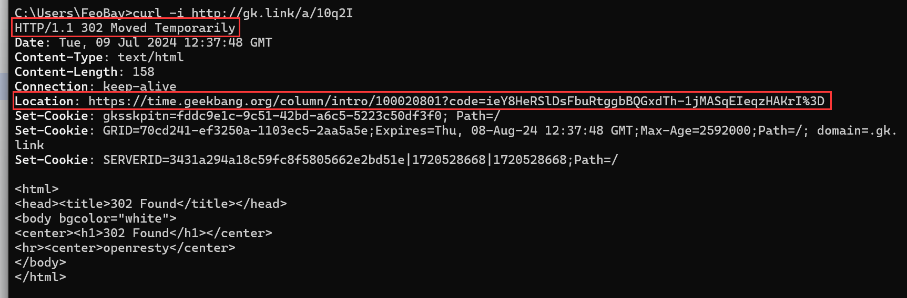

# 1.短链简介

## 1.1.短链是什么

短链：http://gk.link/a/10q2I

长链：https://time.geekbang.org/column/intro/100020801?code=ieY8HeRSlDsFbuRtggbBQGxdTh-1jMASqEIeqzHAKrI%3D

点击得到一样结果

## 短链的价值

- 显而易见， **简洁** 
- 方便使用
  - 部分场景对填写字符串有长度限制，短链此时就发挥作用
  - 短链转换为二维码更容易识别（信息密度低，更易识别）
  - 部分平台无法识别长链的特殊参数，短链无该问题
- 节省成本
  - 短网址比长网址有更少的存储、传输消耗，节省计算机资源

## 1.2.短链原理

302状态码为重定向

1. 浏览器访问短链地址，来到短链服务
2. 短链服务内部通过短链地址查出对应的原始地址（长链），返回一个重定向状态码，带上长链
3. 浏览器收到长链后，再去访问长链服务，最后获取最终的服务，返回到浏览器显示网页内容

## 1.3.如何生成短链

1.哈希算法

2.MySQL自增ID

3.Redis自增ID

4.雪花算法

> 用base62算法将数字ID转换为62进制

